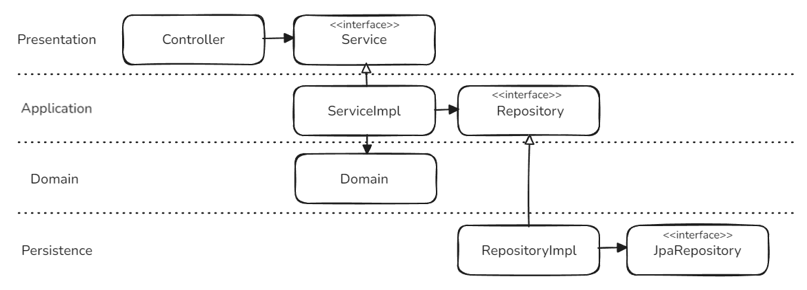
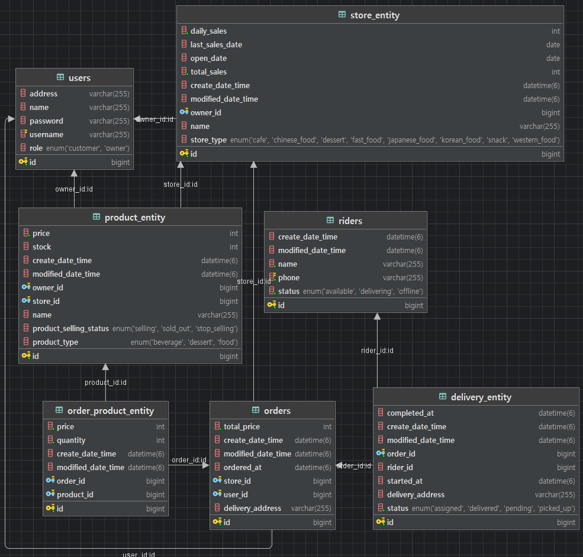

# DeliveryHero

--- 

## Project Overview
- 주문, 재고, 배달 흐름에서 자주 깨지는 지점(인가, 상태 전이, 동시성)을 도메인 규칙과 테스트로 고정한 백엔드 포트폴리오 프로젝트입니다.
- [API 문서 바로가기](https://wooosup.github.io/DeliveryHero/)
- [DB 리뷰 문서](docs/db-review.md)

## One-line Summary
- DeliveryHero는 주문-재고-배달 흐름의 인가, 상태 전이, 동시성 문제를 해결한 Spring Boot 백엔드 프로젝트입니다.

## Technology Stack

- Java 17
- Spring Boot 3.5.6
- JPA
- Docker (MySQL)
- Swagger

## Core Flow
주문 생성 → 재고 차감 → (사장) 주문 수락/거절 → (라이더) 배달 배차/시작/완료 → 주문 완료

## Troubleshooting

### 1. 인증 경계
- 문제: 초기에는 하나의 로그인 주체 해석 방식에 customer, owner, rider가 함께 섞여 있어 컨트롤러 시그니처만 봐서는 누가 호출할 수 있는지 드러나지 않았고, 미인증 요청과 권한 없는 요청도 구분이 흐려질 수 있었음.
- 해결: `@LoginCustomerId`, `@LoginOwnerId`, `@LoginRiderId`로 인증 주체를 분리하고, `AuthorizationIntegrationTest`로 401/403 시나리오를 검증했음.
- 결과: 컨트롤러 시그니처만 봐도 호출 주체가 드러나고, 미인증은 `401`, 권한 없음은 `403`으로 설명할 수 있게 됐음.

### 2. 시간 의존 테스트
- 문제: `LocalDateTime.now()`를 직접 쓰면 주문 가능 시간, 영업 시간, 배달 시각 검증 결과가 실행 시점마다 흔들릴 수 있었음.
- 해결: `ClockHolder`로 현재 시간을 추상화하고, 테스트에서는 `TestClockHolder`로 고정 시간을 주입했음.
- 결과: 시간 의존 로직을 예측 가능하게 검증할 수 있게 됐고, 테스트 재현성이 좋아졌음.

### 3. 상태 전이 정리
- 문제: 주문 취소, 주문 거절, 배달 생성, 배달 시작, 배달 완료 규칙이 분산돼 있으면 잘못된 요청 순서를 막기 어렵고 흐름 설명도 어려웠음.
- 해결: 상태 전이 책임을 `Order`, `Delivery` 도메인에 모으고, `REJECTED` 상태를 추가했음. 또 외부 주문 완료 API를 제거하고, 배달 완료 후 주문 완료가 이어지도록 연결했음.
- 결과: 잘못된 요청을 도메인 단계에서 차단할 수 있게 됐고, 상태표를 코드 기준으로 설명할 수 있게 됐음.

### 4. 재고 동시성
- 문제: 같은 상품에 주문이 동시에 몰리면 같은 재고를 함께 차감해 oversell이 발생할 수 있었음.
- 해결: 상품 조회 구간에 `PESSIMISTIC_WRITE`를 적용하고, MySQL Testcontainers 기반 `OrderConcurrencyIntegrationTest`로 동시 주문을 검증했음.
- 결과: 재고 1개 상품에 주문 2건이 동시에 들어와도 1건만 성공하고 최종 재고가 0으로 유지되는 것을 확인했음.

## Architecture Diagram
<div align="center">
    
</div>

## ERD Diagram
<div align="center">
    
</div>

## How to run

### 1. 로컬 설정 파일 준비

```bash
cp application-secret.properties.example application-secret.properties
```

### 2. MySQL 비밀번호 환경 변수 설정

```bash
export MYSQL_ROOT_PASSWORD=<your-local-password>
```

`application-secret.properties`는 위 환경 변수를 참조한다.

### 3. 로컬 MySQL 실행

```bash
docker compose up -d
```

기본 포트는 `3310`, DB 이름은 `delivery`다.

### 4. 애플리케이션 실행

```bash
./gradlew bootRun
```

### 5. 테스트 실행

```bash
./gradlew test
```

- 일반 통합 테스트는 `src/test/resources/application-test.properties`의 H2 설정을 사용한다.
- `OrderConcurrencyIntegrationTest`는 Testcontainers를 사용하므로 Docker가 켜져 있어야 한다.

### 6. Swagger 확인

- URL: `http://localhost:8080/swagger-ui/index.html`
